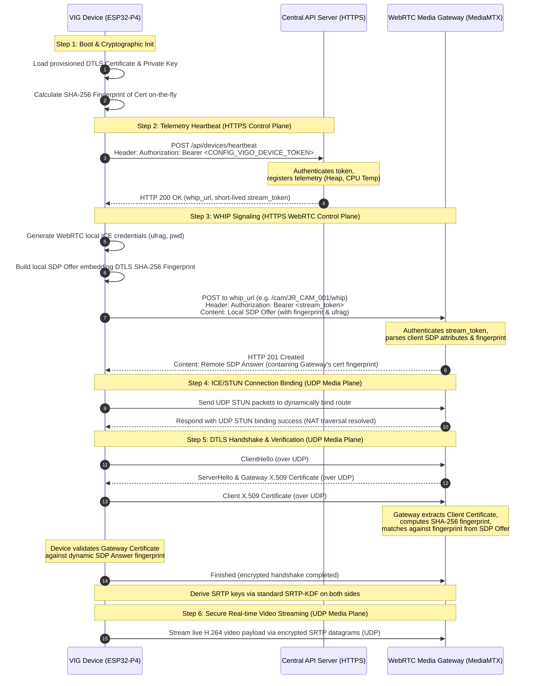

# VIG Technical & Cryptographic Protocol Handbook

This handbook provides an in-depth explanation of the security architecture, communication protocols, and cryptographic design principles underlying the **Video IoT Guardian (VIG)** edge vision firmware.

---

## Connection & Security Protocol Flow

The following sequence diagram illustrates the complete end-to-end network protocol, signaling sequence, NAT traversal checks, and cryptographic handshakes initiated by the VIG device to achieve authenticated streaming:



---

## 1. Device Authentication: `CONFIG_VIGO_DEVICE_TOKEN`

The `CONFIG_VIGO_DEVICE_TOKEN` is a unique long-lived static bearer token configured on the device during provisioning. It represents the root of trust between the hardware unit and the backend:

- **Control Plane Authentication:** On boot and periodically, the device sends HTTP POST heartbeats to the central API server (e.g., `https://api.link.roland-industries.com/api/devices/heartbeat`). To authenticate this request, the device attaches the header `Authorization: Bearer <CONFIG_VIGO_DEVICE_TOKEN>`.
- **Dynamic Stream Authorization:** The backend verifies this token, registers the device telemetry (Heap, Uptime, CPU Temp), and responds with a short-lived, single-use `stream_token` and the target WebRTC `whip_url`. The device then uses this short-lived session token to authenticate its media publish request to the WHIP gateway.

---

## 2. Stream Encryption: `CONFIG_VIGO_DTLS_CERT_PEM` & `CONFIG_VIGO_DTLS_KEY_PEM`

By default, the firmware includes a fallback keypair in its global Kconfig schema. However, **every production or development device MUST be provisioned with its own unique keypair** for the following critical security reasons:

1. **Identity & Authentication:** The DTLS certificate fingerprint is sent in the local SDP (Session Description Protocol) offer during WHIP signaling. The WebRTC server uses this fingerprint to verify the cryptographic identity of the device.
2. **Mitigation of Impersonation / MITM:** If all devices shared a single hardcoded key, a compromise of one device's firmware would expose the key and allow attackers to impersonate any other device on the network or intercept streaming data.
3. **Granular Revocation:** By assigning unique certificates to each device, compromised or retired physical units can be individually revoked/blocked at the signaling server or gateway level without affecting the rest of the fleet.

---

## 3. Does the Backend Need the DTLS Certificate?

**No. The backend web/API application server does not need to store, parse, or directly use the certificate PEM files.**

Here is how the verification pipeline flows:

1. The VIG device generates its own unique self-signed certificate.
2. At runtime, the device computes the **SHA-256 fingerprint** of this certificate on-the-fly and embeds it inside its local SDP Offer as an attribute:
   ```sdp
   a=fingerprint:sha-256 XX:XX:XX...
   ```
3. During WHIP signaling, the device posts this SDP Offer to the WebRTC Media Gateway (e.g., MediaMTX).
4. When the actual UDP connection is established, the Media Gateway and the device perform a standard DTLS handshake. The Media Gateway verifies that the client certificate presented during this handshake matches the fingerprint supplied in the signed SDP Offer.

Thus, the backend control plane only acts as an authenticator for the initial API handshakes (via `CONFIG_VIGO_DEVICE_TOKEN`) and an exchange broker. The media encryption and certificate validation are handled entirely on-the-fly by the device and the WebRTC media gateway.

---

## 4. Where is the Public Key?

You might notice that the firmware configuration only defines `CONFIG_VIGO_DTLS_KEY_PEM` (the private key) and `CONFIG_VIGO_DTLS_CERT_PEM` (the certificate), without a separate public key variable.

**This is because the public key is embedded directly inside the X.509 Certificate itself.**

An X.509 certificate is not just a digital signature; it is an ASN.1 structured cryptographic container containing:

1. **Metadata:** Subject details (e.g., `/CN=VigoDevice`), validity period, and issuer.
2. **Subject Public Key Info:** The actual raw ECDSA public key coordinates (the $x$ and $y$ points on the `secp256r1` curve) and the algorithm identifier.
3. **Issuer's Cryptographic Signature:** Proving that the container has not been tampered with.

During the DTLS Handshake:

- The VIG device sends its certificate (`CONFIG_VIGO_DTLS_CERT_PEM`) to the WebRTC Media Gateway over UDP.
- The Gateway extracts the **public key** directly from the certificate's _Subject Public Key Info_ field.
- The Gateway then uses this public key to verify a cryptographic signature sent by the VIG device during the handshake. This proves that the device possesses the matching private key (`CONFIG_VIGO_DTLS_KEY_PEM`) without the private key ever leaving the ESP32-P4 hardware.

---

## 5. Cryptographic Architecture: Why UDP & DTLS Dictate This Model

The use of on-the-fly certificate validation via SDP fingerprints is directly coupled to WebRTC's reliance on **UDP** and **Peer-to-Peer (P2P)** network architectures:

1. **UDP is Stateless and Connectionless**:
   Unlike TCP, where a stateful, persistent OS socket exists between a client and a server, UDP simply sends raw datagrams. Since any device on the internet can send packets to the WebRTC server's open UDP media ports, the server must have a cryptographically secure method to identify which incoming UDP packets belong to our authenticated VIG device. Running a **DTLS (Datagram Transport Layer Security)** handshake directly on that raw UDP socket—and checking that the certificate matches the signed SDP fingerprint—binds the UDP media stream securely to the authenticated HTTPS signaling session.

2. **NATs and Firewalls (IP Address Unreliability)**:
   In IoT deployments, physical devices reside behind home routers or enterprise firewalls using **NAT (Network Address Translation)**. When the device sends UDP packets, the NAT router dynamically maps public IP addresses and ports. Because symmetric NATs can change these mappings dynamically, the WebRTC server **cannot authenticate incoming media by source IP or port**. The only persistent, spoof-proof identity of the stream is the self-signed certificate presented inside the UDP DTLS datagrams.

3. **DTLS vs. TLS over UDP**:
   Because UDP does not guarantee packet ordering or reliable delivery, standard **TLS** (which requires TCP) cannot be used. WebRTC uses **DTLS** (TLS adapted for connectionless packets). Since DTLS is a P2P protocol, exchanging fingerprints out-of-band over a secure HTTPS signaling channel is the most lightweight, robust, and performant way to anchor cryptographic trust without relying on expensive, online Certificate Authority (CA) validation loops over connectionless sockets.

---

## 6. WHIP Protocol Implementation Details

### 6.1 SDP Offer Construction

The device builds a minimal SDP offer and POSTs it to the WHIP endpoint (the URL returned by the heartbeat). The offer includes:

- A single `m=video` line with `RTP/SAVPF` and dynamic payload type `96` mapped to `H264/90000`.
- `a=fmtp:96 packetization-mode=1;profile-level-id=42e01f` — Baseline Profile Level 3.1 with FU-A fragmentation.
- `a=setup:actpass` — signals to the remote peer that the device can act as either DTLS client or server.
- `a=sendonly` — the device only sends media, never receives it.
- `a=rtcp-mux` — RTCP and RTP are multiplexed on the same UDP port.
- `a=ice-ufrag` and `a=ice-pwd` — freshly generated random credentials for this session.
- `a=fingerprint:sha-256 <XX:XX:...>` — the SHA-256 hash of the device's DTLS certificate, computed at runtime.

The WHIP server must respond with HTTP `201 Created` and an SDP answer in the body. Any other HTTP status code is treated as a failure.

### 6.2 DTLS Role Negotiation

The DTLS role is determined by the `a=setup:` attribute in the **remote SDP answer**, following RFC 5763:

| Remote `a=setup:` value | Our DTLS role                                                            |
| ----------------------- | ------------------------------------------------------------------------ |
| `active`                | **Server** — we wait for ClientHello                                     |
| `passive`               | **Client** — we send ClientHello                                         |
| `actpass`               | **Client** — we initiate (we prefer client when both sides are flexible) |

With MediaMTX the server always answers `a=setup:active`, so the VIG device always acts as the DTLS **server** in practice.

When acting as server, the `HelloVerifyRequest` cookie exchange is **disabled** (`mbedtls_ssl_conf_dtls_cookies(..., NULL, NULL, NULL)`). ICE connectivity checks have already cryptographically verified the peer's address via HMAC-SHA1 signed STUN packets, making the cookie round-trip redundant and a source of interoperability failures with WebRTC clients.

### 6.3 ICE Connectivity Checks

Before the DTLS handshake, the device performs lightweight ICE connectivity checks:

1. **Outbound STUN Binding Request** — sent up to 5 times to `remote_ip_:remote_port_` (extracted from the SDP answer). The request carries:
   - `USERNAME` attribute: `remote_ufrag:local_ufrag`
   - `PRIORITY` attribute
   - `ICE-CONTROLLING` attribute (the device is always the controlling agent)
   - `MESSAGE-INTEGRITY`: HMAC-SHA1 over the packet using `remote_pwd_` as the key
   - `FINGERPRINT`: CRC32 of the packet XORed with `0x5354554E`

2. **Inbound STUN Binding Requests** — MediaMTX also sends its own binding checks. These are handled inside `dtls_recv()` during the packet dispatch loop. The device replies with a `Binding Success Response (0x0101)` containing:
   - `XOR-MAPPED-ADDRESS` attribute
   - `MESSAGE-INTEGRITY` signed with `local_pwd_`
   - `FINGERPRINT`

3. **Stale packet drain** — after the ICE phase, any residual STUN packets are drained from the socket before handing it over to mbedTLS, preventing the DTLS state machine from seeing unexpected non-DTLS bytes.

### 6.4 SRTP Key Derivation

After the DTLS handshake completes, the device derives SRTP session keys following **RFC 5764 §4.2** and **RFC 3711 §4.3**.

**Step 1 — Export TLS master secret.**  
The mbedTLS export-keys callback (`srtp_export_keys_cb`) captures the 48-byte TLS 1.2 master secret and both client/server random values before the handshake finishes.

**Step 2 — Run TLS PRF to obtain 60 bytes of keying material.**

```
PRF(master_secret, "EXTRACTOR-dtls_srtp", client_random || server_random) → 60 bytes
```

**Step 3 — Slice the keying material (RFC 5764 §4.2).**

| Offset | Length | Field                           |
| ------ | ------ | ------------------------------- |
| 0      | 16     | `client_write_SRTP_master_key`  |
| 16     | 16     | `server_write_SRTP_master_key`  |
| 32     | 14     | `client_write_SRTP_master_salt` |
| 46     | 14     | `server_write_SRTP_master_salt` |

**Step 4 — Select the correct write keys for the sending direction.**

> **Critical:** a device must always use its own _write_ keys to protect outgoing packets. This means:
>
> - Acting as DTLS **server** → use `server_write` key (offset 16) and `server_write` salt (offset 46)
> - Acting as DTLS **client** → use `client_write` key (offset 0) and `client_write` salt (offset 32)
>
> Using the wrong set of keys (e.g. always using `client_write` regardless of role) produces SRTP packets that the receiver cannot decrypt, causing MediaMTX to report **"deadline exceeded while waiting tracks"** and never publishing the stream.

**Step 5 — Derive three sub-keys via the SRTP KDF (RFC 3711 §4.3).**

Each sub-key is derived by AES-128-ECB-encrypting a counter block formed from the master salt XORed with a label byte and a block counter:

| Label  | Usage                                             |
| ------ | ------------------------------------------------- |
| `0x00` | Cipher key (16 bytes) — AES-128-CM encryption key |
| `0x01` | Auth key (20 bytes) — HMAC-SHA1-80 key            |
| `0x02` | Session salt (14 bytes) — AES-128-CM IV base      |

**Step 6 — Pre-import keys into the PSA Crypto hardware engine.**  
The cipher key and auth key are imported into the PSA keystore once after setup (`psa_import_key`) and reused for every packet. This avoids a per-packet import/destroy cycle which was a significant performance bottleneck at 30 fps.

### 6.5 RTP Packetization

The device sends H.264 encoded frames as RTP streams with payload type `96`:

- **Small frames** (≤ 1400 bytes): sent as a single RTP packet with the marker bit set.
- **Large frames** (> 1400 bytes): fragmented using **FU-A (Fragmentation Unit Type A)** per RFC 6184:
  - The original NALU header byte is replaced by a two-byte FU header: `[FU indicator | FU header]`.
  - FU indicator: top 3 bits from the original NALU header, NALU type = 28.
  - FU header: NALU type from the original header, plus Start (`0x80`) / End (`0x40`) bits.
  - The marker bit is set only on the last fragment.

RTP timestamps use the 90 kHz clock (`pts_ms * 90`). The SSRC is fixed at `0x12345678` for the session.

### 6.6 SRTP Packet Protection

Each outgoing RTP packet is protected by `srtp_protect()`:

1. **AES-128-CM encryption** of the RTP payload (header is left in plaintext):
   - IV construction: `session_salt` XORed with SSRC bytes (at positions 4–7) and the 48-bit packet index (at positions 8–13).
   - Packet index: `(ROC << 16) | seq_num`, where ROC (Roll-Over Counter) increments when `seq_num` wraps past 32768.

2. **HMAC-SHA1-80 authentication tag** appended to the encrypted packet:
   - Input to HMAC: the entire packet (header + encrypted payload) followed by a 4-byte big-endian ROC.
   - Only the first 10 bytes of the 20-byte HMAC output are appended (truncated to 80 bits, per SRTP-AES128-CM-HMAC-SHA1-80 profile).
